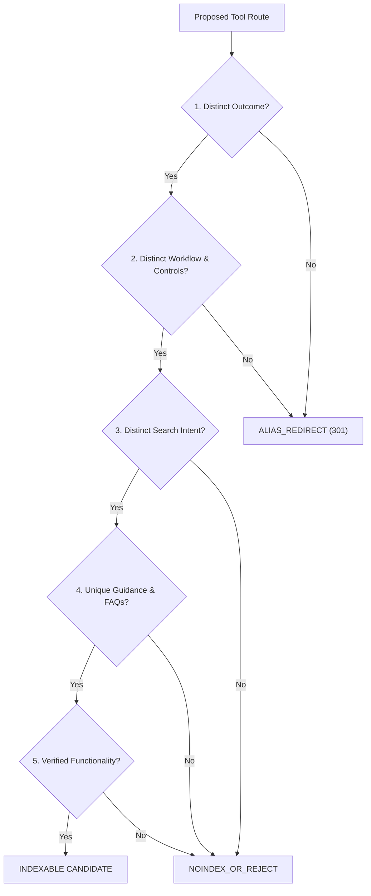

# FileKit Official SEO Indexability Policy & Intent Expansion Framework

> **Policy Statement**: FileKit creates a separate indexable page **only** when a route satisfies a distinct search intent through a materially different output, workflow, configuration, or guidance. Pure terminology, spelling, and format aliases use 301 permanent redirects to one canonical route.

---

## ⚖️ Google Search Quality & Policy Alignment (Post-March 2024 Core Update)

1. **People-First Helpful Content**: Google’s core ranking systems assess whether pages provide genuine value to human users. Scaled-content spam policies target pages created primarily to manipulate rankings rather than perform useful work.
2. **URL Signal Consolidation (Not Spam Penalty)**: Near-duplicate pages dilute internal links and cause Google to unpredictably consolidate or ignore URLs. This is an **SEO architecture efficiency problem**, not a named spam penalty.
3. **Indexing Attention & URL Inventory**: For early-stage products, the primary risk of thin page creation is **wasted indexing attention** (pages listed as *"Crawled - currently not indexed"*) rather than crawl-budget exhaustion.
4. **Signal Transfer via Redirects**: A 301 permanent redirect consolidates URL signals to the canonical route. The canonical target page must naturally mention both synonym terms (e.g. *"Convert PDF pages to JPG or JPEG images"*).

---

## 📐 The 5-Dimension Indexability Decision Model

Every prospective route must pass all 5 evaluation dimensions before being approved for indexing:

| Dimension | Requirement | Example Validation |
|---|---|---|
| **1. Outcome** | Materially different output format or document transformation. | `.png` (lossless image) vs `.jpg` (lossy image) vs `.pdf` (document). |
| **2. Interface** | Route-specific UI controls, default presets, or workspace tools. | PNG resolution preset vs JPG quality slider vs Drag-and-drop Page Reorder grid. |
| **3. Intent** | Users seeking a materially different solution. | Users needing to extract single pages vs users needing to combine 5 files into 1. |
| **4. Guidance** | Useful format-specific explanations, tradeoffs, and FAQs. | Explaining JPEG artifacts vs PNG line-art sharpness (not generic template text). |
| **5. Functionality** | Fully working client or server engine execution. | Clean 100% local processing; no placeholder or fake doorway pages. |

---

## 🏷️ Route Classification Taxonomy

### 1. `INDEXABLE`
- Satisfies all 5 indexability dimensions.
- Features self-referencing canonical URL (`<link rel="canonical" href="https://filekit.com/route" />`).
- Included in XML sitemap (`/sitemap.xml`).
- *Examples*: `/compress-pdf`, `/merge-pdf`, `/split-pdf`, `/pdf-to-jpg`, `/pdf-to-png`, `/image-to-pdf`, `/convert-image`.

### 2. `ALIAS_REDIRECT` (301 Permanent Redirect)
- Shares identical operation and output with an existing canonical route.
- Represents a spelling variant, extension abbreviation, or direct linguistic synonym.
- Excluded from sitemap and navigation menus; 301 redirects to canonical destination.
- *Examples*:
  - `/pdf-to-jpeg` ──(301)──► `/pdf-to-jpg`
  - `/pdf-to-picture` ──(301)──► `/pdf-to-image`
  - `/jpeg-to-pdf` ──(301)──► `/jpg-to-pdf`
  - `/pdf-to-docx` ──(301)──► `/pdf-to-word`

### 3. `HUB`
- Multi-format aggregate route guiding users to the correct specialized tool.
- Links internally to child tool routes; does not duplicate child-page copy.
- *Examples*: `/pdf-to-image` (hub for JPG, PNG, WebP), `/convert-image` (hub for format conversions).

### 4. `NOINDEX_OR_REJECT`
- Thin keyword variation (e.g. `/online-pdf-to-jpg`, `/free-pdf-to-jpg`, `/fast-pdf-to-jpg`).
- Unsupported or low-value specialized format conversions (e.g. `/pdf-to-dxf`, `/pdf-to-epub`).
- Rejected from portfolio; returns 404 or set to `noindex`.

---

## 🔍 Google Search Console Monitoring Metrics

FileKit tracks route health via Google Search Console using the following key indicators:

1. **Indexed vs. Submitted Ratio**: Ensure >90% of sitemap URLs are indexed.
2. **Canonical Consistency**: Verify Google-selected canonical matches user-declared canonical.
3. **Excluded Status Tracking**: Audit URLs under *"Crawled - currently not indexed"* or *"Discovered - currently not indexed"*.
4. **Query Clustering**: Monitor impression overlap across competing routes.
