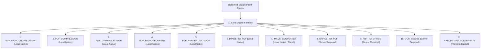

# FileKit Route Portfolio & Engine Architecture Inspired by PDFAid

> **Source Fidelity Note**: Observed route labels and original categories in Document A are preserved **100% identically** from the published PDFAid landing page catalog. Analytical classification columns (probable engine family, route type, confidence) are added separately by FileKit analysts.

---

## 🏛️ Executive Engine-Family Mapping (11 Core Families)



---

## 📁 DOCUMENT A: Observed PDFAid 84-Route Inventory

*(Exact 84 observed competitor landing pages across 4 categories: 24 From PDF, 24 To PDF, 24 Convert Image, 12 Edit PDF)*

| # | Observed Route Label | Original Category | Normalized Search Intent | Probable Engine Family | Competitor Route Type | Inferred Confidence |
|---|---|---|---|---|---|---|
| **1** | PDF to Word | From PDF | Convert PDF to Word document | `PDF_TO_OFFICE` | Distinct Operation | HIGH |
| **2** | PDF to Excel | From PDF | Convert PDF to Excel spreadsheet | `PDF_TO_OFFICE` | Distinct Operation | HIGH |
| **3** | PDF to PPTX | From PDF | Convert PDF to PPTX presentation | `PDF_TO_OFFICE` | Format Variant | HIGH |
| **4** | PDF to DXF | From PDF | Convert PDF to AutoCAD DXF vector | `SPECIALIZED_CONVERSION` | Specialized | HIGH |
| **5** | PDF to JPG | From PDF | Render PDF pages to JPG images | `PDF_RENDER_TO_IMAGE` | Distinct Operation | HIGH |
| **6** | PDF to EPUB | From PDF | Convert PDF to EPUB eBook | `SPECIALIZED_CONVERSION` | Specialized | HIGH |
| **7** | PDF to SVG | From PDF | Convert PDF to SVG vector | `SPECIALIZED_CONVERSION` | Specialized | HIGH |
| **8** | PDF to TXT | From PDF | Extract raw text from PDF | `PDF_TO_OFFICE` | Distinct Operation | HIGH |
| **9** | PDF to JPEG | From PDF | Render PDF pages to JPEG images | `PDF_RENDER_TO_IMAGE` | Synonym Variant | HIGH |
| **10** | PDF to HTML | From PDF | Convert PDF to HTML webpage | `PDF_TO_OFFICE` | Distinct Operation | HIGH |
| **11** | PDF to Image | From PDF | Render PDF pages to Image Zip | `PDF_RENDER_TO_IMAGE` | Distinct Hub | HIGH |
| **12** | PDF to PNG | From PDF | Render PDF pages to PNG images | `PDF_RENDER_TO_IMAGE` | Distinct Operation | HIGH |
| **13** | PDF to Pages | From PDF | Convert PDF to Apple Pages file | `PDF_TO_OFFICE` | Format Variant | MEDIUM |
| **14** | PDF to Picture | From PDF | Render PDF pages to Picture Zip | `PDF_RENDER_TO_IMAGE` | Synonym Variant | HIGH |
| **15** | PDF to TIFF | From PDF | Render PDF pages to TIFF images | `PDF_RENDER_TO_IMAGE` | Format Variant | HIGH |
| **16** | PDF to EPS | From PDF | Convert PDF to PostScript vector | `SPECIALIZED_CONVERSION` | Specialized | HIGH |
| **17** | PDF to PSD | From PDF | Convert PDF to Photoshop PSD | `SPECIALIZED_CONVERSION` | Specialized | HIGH |
| **18** | PDF to XLS | From PDF | Convert PDF to XLS spreadsheet | `PDF_TO_OFFICE` | Format Variant | HIGH |
| **19** | PDF to XLSX | From PDF | Convert PDF to XLSX spreadsheet | `PDF_TO_OFFICE` | Format Variant | HIGH |
| **20** | PDF to MOBI | From PDF | Convert PDF to Kindle MOBI eBook | `SPECIALIZED_CONVERSION` | Specialized | HIGH |
| **21** | PDF to BMP | From PDF | Render PDF pages to BMP images | `PDF_RENDER_TO_IMAGE` | Format Variant | HIGH |
| **22** | PDF to RTF | From PDF | Convert PDF to Rich Text Format | `PDF_TO_OFFICE` | Format Variant | HIGH |
| **23** | PDF to GIF | From PDF | Render PDF pages to GIF images | `PDF_RENDER_TO_IMAGE` | Format Variant | HIGH |
| **24** | PDF to AZW3 | From PDF | Convert PDF to AZW3 eBook | `SPECIALIZED_CONVERSION` | Specialized | HIGH |
| **25** | Image to PDF | To PDF | Convert images to PDF document | `IMAGE_TO_PDF` | Distinct Hub | HIGH |
| **26** | Word to PDF | To PDF | Convert Word document to PDF | `OFFICE_TO_PDF` | Distinct Operation | HIGH |
| **27** | DWG to PDF | To PDF | Convert AutoCAD DWG to PDF | `SPECIALIZED_CONVERSION` | Specialized | HIGH |
| **28** | Excel to PDF | To PDF | Convert Excel spreadsheet to PDF | `OFFICE_TO_PDF` | Distinct Operation | HIGH |
| **29** | HTML to PDF | To PDF | Convert HTML webpage to PDF | `OFFICE_TO_PDF` | Distinct Operation | HIGH |
| **30** | PowerPoint to PDF | To PDF | Convert PowerPoint file to PDF | `OFFICE_TO_PDF` | Distinct Operation | HIGH |
| **31** | ODT to PDF | To PDF | Convert OpenDocument text to PDF | `OFFICE_TO_PDF` | Format Variant | HIGH |
| **32** | EPUB to PDF | To PDF | Convert EPUB eBook to PDF | `SPECIALIZED_CONVERSION` | Specialized | HIGH |
| **33** | Pages to PDF | To PDF | Convert Apple Pages file to PDF | `OFFICE_TO_PDF` | Format Variant | MEDIUM |
| **34** | HWP to PDF | To PDF | Convert Hangul Word file to PDF | `SPECIALIZED_CONVERSION` | Specialized | HIGH |
| **35** | HEIC to PDF | To PDF | Convert HEIC photos to PDF | `IMAGE_TO_PDF` | Distinct Operation | HIGH |
| **36** | PPTX to PDF | To PDF | Convert PPTX file to PDF | `OFFICE_TO_PDF` | Format Variant | HIGH |
| **37** | WPS to PDF | To PDF | Convert WPS document to PDF | `OFFICE_TO_PDF` | Format Variant | HIGH |
| **38** | CSV to PDF | To PDF | Convert CSV table to PDF | `OFFICE_TO_PDF` | Format Variant | HIGH |
| **39** | TXT to PDF | To PDF | Convert TXT plain text to PDF | `OFFICE_TO_PDF` | Format Variant | HIGH |
| **40** | PPT to PDF | To PDF | Convert PPT presentation to PDF | `OFFICE_TO_PDF` | Format Variant | HIGH |
| **41** | TIFF to PDF | To PDF | Convert TIFF images to PDF | `IMAGE_TO_PDF` | Format Variant | HIGH |
| **42** | AI to PDF | To PDF | Convert Adobe Illustrator to PDF | `SPECIALIZED_CONVERSION` | Specialized | HIGH |
| **43** | RTF to PDF | To PDF | Convert Rich Text Format to PDF | `OFFICE_TO_PDF` | Format Variant | HIGH |
| **44** | MD to PDF | To PDF | Convert Markdown text to PDF | `OFFICE_TO_PDF` | Distinct Operation | HIGH |
| **45** | SVG to PDF | To PDF | Convert SVG vector to PDF | `SPECIALIZED_CONVERSION` | Specialized | HIGH |
| **46** | PUB to PDF | To PDF | Convert Microsoft Publisher to PDF | `OFFICE_TO_PDF` | Format Variant | HIGH |
| **47** | DXF to PDF | To PDF | Convert AutoCAD DXF to PDF | `SPECIALIZED_CONVERSION` | Specialized | HIGH |
| **48** | CDR to PDF | To PDF | Convert CorelDRAW vector to PDF | `SPECIALIZED_CONVERSION` | Specialized | HIGH |
| **49** | Image to JPG | Convert Image | Convert images to JPG format | `IMAGE_CONVERTER` | Distinct Operation | HIGH |
| **50** | Image to Word | Convert Image | OCR image into Word document | `OCR_ENGINE` | Distinct Operation | HIGH |
| **51** | HEIC to JPG | Convert Image | Convert iPhone HEIC to JPG | `IMAGE_CONVERTER` | Distinct Operation | HIGH |
| **52** | JPEG to EPS | Convert Image | Convert JPEG image to EPS vector | `SPECIALIZED_CONVERSION` | Specialized | HIGH |
| **53** | PNG to EPS | Convert Image | Convert PNG image to EPS vector | `SPECIALIZED_CONVERSION` | Specialized | HIGH |
| **54** | Video to GIF | Convert Image | Convert video clip to animated GIF | `SPECIALIZED_CONVERSION` | Specialized | HIGH |
| **55** | PNG to JPG | Convert Image | Convert PNG image to JPG | `IMAGE_CONVERTER` | Distinct Operation | HIGH |
| **56** | JPG to PNG | Convert Image | Convert JPG image to PNG | `IMAGE_CONVERTER` | Distinct Operation | HIGH |
| **57** | MP4 to GIF | Convert Image | Convert MP4 video to animated GIF | `SPECIALIZED_CONVERSION` | Format Variant | HIGH |
| **58** | PNG to ICO | Convert Image | Convert PNG image to ICO favicon | `IMAGE_CONVERTER` | Distinct Operation | HIGH |
| **59** | Image to PNG | Convert Image | Convert images to PNG format | `IMAGE_CONVERTER` | Distinct Operation | HIGH |
| **60** | Image to Excel | Convert Image | OCR image into Excel table | `OCR_ENGINE` | Distinct Operation | HIGH |
| **61** | Image to SVG | Convert Image | Vectorize raster image to SVG | `SPECIALIZED_CONVERSION` | Specialized | HIGH |
| **62** | WEBP to JPG | Convert Image | Convert WebP image to JPG | `IMAGE_CONVERTER` | Distinct Operation | HIGH |
| **63** | Image to GIF | Convert Image | Convert images to GIF format | `IMAGE_CONVERTER` | Distinct Operation | HIGH |
| **64** | JPEG to PNG | Convert Image | Convert JPEG image to PNG | `IMAGE_CONVERTER` | Synonym Variant | HIGH |
| **65** | SVG to PNG | Convert Image | Render SVG vector to PNG image | `SPECIALIZED_CONVERSION` | Specialized | HIGH |
| **66** | JFIF to JPG | Convert Image | Convert JFIF file to JPG format | `IMAGE_CONVERTER` | Synonym Variant | HIGH |
| **67** | AVIF to JPG | Convert Image | Convert AVIF image to JPG | `IMAGE_CONVERTER` | Distinct Operation | HIGH |
| **68** | DOCX to JPG | Convert Image | Render Word document to JPG | `OFFICE_TO_PDF` | Format Variant | MEDIUM |
| **69** | SVG to DXF | Convert Image | Convert SVG vector to DXF CAD | `SPECIALIZED_CONVERSION` | Specialized | HIGH |
| **70** | EPS to SVG | Convert Image | Convert EPS vector to SVG | `SPECIALIZED_CONVERSION` | Specialized | HIGH |
| **71** | HTML to JPG | Convert Image | Render HTML webpage to JPG | `OFFICE_TO_PDF` | Format Variant | MEDIUM |
| **72** | Word to JPG | Convert Image | Render Word document to JPG | `OFFICE_TO_PDF` | Format Variant | MEDIUM |
| **73** | Edit PDF | Edit PDF | Master PDF editor workspace | `PDF_OVERLAY_EDITOR` | Distinct Hub | HIGH |
| **74** | Sign PDF | Edit PDF | Add visual signature to PDF | `PDF_OVERLAY_EDITOR` | Distinct Operation | HIGH |
| **75** | Rotate PDF | Edit PDF | Rotate PDF page orientation | `PDF_PAGE_ORGANIZATION` | Distinct Operation | HIGH |
| **76** | Merge PDF | Edit PDF | Merge multiple PDF files | `PDF_PAGE_ORGANIZATION` | Distinct Operation | HIGH |
| **77** | Split PDF | Edit PDF | Split PDF into separate pages | `PDF_PAGE_ORGANIZATION` | Distinct Operation | HIGH |
| **78** | Crop PDF | Edit PDF | Change visible CropBox bounds | `PDF_PAGE_GEOMETRY` | Distinct Operation | HIGH |
| **79** | Add watermark | Edit PDF | Stamp text or image watermark | `PDF_OVERLAY_EDITOR` | Distinct Operation | HIGH |
| **80** | Add image to PDF | Edit PDF | Overlay image onto PDF page | `PDF_OVERLAY_EDITOR` | Distinct Operation | HIGH |
| **81** | Compress image | Edit PDF | Compress image file size | `IMAGE_CONVERTER` | Distinct Operation | HIGH |
| **82** | Compress PDF | Edit PDF | Compress PDF file size | `PDF_COMPRESSION` | Distinct Operation | HIGH |
| **83** | Delete pages | Edit PDF | Delete selected pages from PDF | `PDF_PAGE_ORGANIZATION` | Distinct Operation | HIGH |
| **84** | OCR PDF | Edit PDF | Convert scanned PDF to text | `OCR_ENGINE` | Distinct Operation | HIGH |

---

## 🏛️ DOCUMENT B: FileKit Normalized Route Portfolio

Below is FileKit's normalized, production-safe route portfolio with capability-driven processing modes and SEO canonical rules:

### 1. Engine Family Architecture (11 Core Families)
1. `PDF_PAGE_ORGANIZATION` (Local Native: `pdf-lib` + `pdfjs-dist`)
2. `PDF_COMPRESSION` (Local Native: `pdf-lib` stream optimizer)
3. `PDF_OVERLAY_EDITOR` (Local Native: `pdf-lib` drawing & stamp overlays)
4. `PDF_PAGE_GEOMETRY` (Local Native: `pdf-lib` CropBox / MediaBox modifiers)
5. `PDF_RENDER_TO_IMAGE` (Local Native: `pdfjs-dist` Canvas rasterizer)
6. `IMAGE_TO_PDF` (Local Native: `pdf-lib` image embedder)
7. `IMAGE_CONVERTER` (Local Native / Gated: OffscreenCanvas + HEIC WASM)
8. `OFFICE_TO_PDF` (Server Required: Headless LibreOffice container cluster)
9. `PDF_TO_OFFICE` (Server Required: Layout parser + OCR document rebuilders)
10. `OCR_ENGINE` (Server Required: Tesseract / paddleOCR services)
11. `SPECIALIZED_CONVERSION` (Planning Bucket Only: Sub-buckets `VECTOR`, `CAD`, `EBOOK`, `VIDEO`, `REGIONAL_OFFICE`)

### 2. Processing Mode Taxonomy
* `LOCAL_NATIVE`: Pure client-side JavaScript running 100% in browser.
* `LOCAL_CAPABILITY_GATED`: Browser local execution subject to API/WASM support.
* `SERVER_REQUIRED`: Requires server conversion worker containers.
* `UNSUPPORTED`: Excluded due to low ROI / high support burden.

```ts
export interface ToolOperationManifest {
  operationId: string;
  engineFamily:
    | "PDF_PAGE_ORGANIZATION"
    | "PDF_COMPRESSION"
    | "PDF_OVERLAY_EDITOR"
    | "PDF_PAGE_GEOMETRY"
    | "PDF_RENDER_TO_IMAGE"
    | "IMAGE_TO_PDF"
    | "IMAGE_CONVERTER"
    | "OFFICE_TO_PDF"
    | "PDF_TO_OFFICE"
    | "OCR_ENGINE"
    | "SPECIALIZED_CONVERSION";
  canonicalRoute: string;
  aliases: string[];
  inputFormats: string[];
  outputFormats: string[];
  processingMode: "LOCAL_NATIVE" | "LOCAL_CAPABILITY_GATED" | "SERVER_REQUIRED" | "UNSUPPORTED";
  implementationStatus: "LIVE" | "BETA" | "PLANNED" | "DEFERRED" | "REJECTED";
  indexable: boolean;
  localizationEligible: boolean;
}
```

---

## 🚀 Refined Track C Subtracks (PDF Editing & Page Geometry)

To maintain safety and operational predictability, **Track C** is split into 3 distinct engineering subtracks:

### Track C1: Deterministic Overlays (Next Development Priority)
* `/watermark-pdf`: Stamp text/image watermarks with opacity and rotation.
* `/add-image-to-pdf`: Embed visual images onto specific page coordinates.
* `/add-page-numbers-to-pdf`: Render footer/header page numbers across documents.
* `/sign-pdf` (Interface Copy: *"Add visual signature to your PDF"*): Draw signature on canvas or upload signature image and overlay onto page.

### Track C2: Visual Markup Workspace
* `/annotate-pdf`: Freehand drawing, text callouts, shapes, and highlights.
* `/add-text-to-pdf`: Add text blocks onto existing PDF pages.
* Requires coordinate mapping, zoom transformations, object selection, and multi-page layer ordering.

### Track C3: Page Geometry Engine
* `/crop-pdf`: Adjust visible `CropBox` boundaries with UI disclosure: *"Cropping changes visible page boundaries. It does not securely erase hidden content."*
* `/resize-pdf-pages`: Convert page dimensions (A4 ↔ Letter ↔ Legal).

---

## 🌐 Localization & URL Slug Schema

FileKit handles international expansion by decoupling `operationId` from localized URL paths:

```ts
export const LOCALIZED_ROUTE_MAP: Record<string, Record<string, string>> = {
  "pdf-merge": {
    en: "/merge-pdf",
    es: "/combinar-pdf",
    "pt-BR": "/juntar-pdf",
    de: "/pdf-zusammenfuegen",
    fr: "/fusionner-pdf",
  },
  "pdf-split": {
    en: "/split-pdf",
    es: "/dividir-pdf",
    "pt-BR": "/separar-pdf",
    de: "/pdf-teilen",
    fr: "/diviser-pdf",
  },
  "pdf-compress": {
    en: "/compress-pdf",
    es: "/comprimir-pdf",
    "pt-BR": "/compactar-pdf",
    de: "/pdf-verkleinern",
    fr: "/compresser-pdf",
  },
};
```
