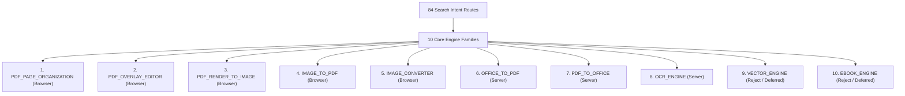

# PDFAid 84-Route Competitive Classification Matrix & FileKit Architectural Blueprint

> **Strategic Summary**: PDFAid operates 84 landing pages across 4 acquisition verticals ("From PDF", "To PDF", "Image Conversion", and "PDF Editing"). However, these 84 routes map to exactly **10 core engine families**. FileKit will adopt PDFAid's programmatic acquisition breadth while strictly enforcing canonical alias redirects to prevent doorway-page search penalties.

---

## 🏛️ Executive Engine-Family Mapping



---

## 📊 Exhaustive 84-Route Classification Matrix

| # | Route / Competitor Intent | Input Format | Output Format | Core Engine Family | Processing Tier | SEO Status | Canonical Target / Alias Rule | FileKit Priority |
|---|---|---|---|---|---|---|---|---|
| **1** | Merge PDF | `.pdf` (xN) | `.pdf` | `PDF_PAGE_ORGANIZATION` | Browser (Client) | Indexable | `/merge-pdf` | **P0 (Implemented)** |
| **2** | Split PDF | `.pdf` | `.pdf` (xN) | `PDF_PAGE_ORGANIZATION` | Browser (Client) | Indexable | `/split-pdf` | **P0 (Implemented)** |
| **3** | Reorder PDF Pages | `.pdf` | `.pdf` | `PDF_PAGE_ORGANIZATION` | Browser (Client) | Indexable | `/reorder-pdf-pages` | **P0 (Implemented)** |
| **4** | Rotate PDF Pages | `.pdf` | `.pdf` | `PDF_PAGE_ORGANIZATION` | Browser (Client) | Indexable | `/rotate-pdf-pages` | **P0 (Implemented)** |
| **5** | Delete PDF Pages | `.pdf` | `.pdf` | `PDF_PAGE_ORGANIZATION` | Browser (Client) | Indexable | `/delete-pdf-pages` | **P0 (Implemented)** |
| **6** | Extract PDF Pages | `.pdf` | `.pdf` | `PDF_PAGE_ORGANIZATION` | Browser (Client) | Indexable | `/extract-pdf-pages` | **P0 (Implemented)** |
| **7** | Compress PDF | `.pdf` | `.pdf` | `PDF_COMPRESSION` | Browser (Client) | Indexable | `/compress-pdf` | **P0 (Implemented)** |
| **8** | Compress PDF to Size | `.pdf` | `.pdf` | `PDF_COMPRESSION` | Browser (Client) | Indexable | `/compress-pdf-to-size` | **P0 (Implemented)** |
| **9** | Compress PDF to 2MB | `.pdf` | `.pdf` | `PDF_COMPRESSION` | Browser (Client) | Indexable | `/compress-pdf-to-2mb` | **P0 (Implemented)** |
| **10** | Add Watermark to PDF | `.pdf` + Text/Img | `.pdf` | `PDF_OVERLAY_EDITOR` | Browser (Client) | Indexable | `/watermark-pdf` | **P1 (Track C1)** |
| **11** | Add Image to PDF | `.pdf` + Image | `.pdf` | `PDF_OVERLAY_EDITOR` | Browser (Client) | Indexable | `/add-image-to-pdf` | **P1 (Track C1)** |
| **12** | Add Page Numbers to PDF | `.pdf` | `.pdf` | `PDF_OVERLAY_EDITOR` | Browser (Client) | Indexable | `/add-page-numbers-to-pdf` | **P1 (Track C1)** |
| **13** | Annotate PDF | `.pdf` | `.pdf` | `PDF_OVERLAY_EDITOR` | Browser (Client) | Indexable | `/annotate-pdf` | **P1 (Track C1)** |
| **14** | Sign PDF | `.pdf` + Drawing | `.pdf` | `PDF_OVERLAY_EDITOR` | Browser (Client) | Indexable | `/sign-pdf` | **P1 (Track C1)** |
| **15** | Crop PDF | `.pdf` | `.pdf` | `PDF_OVERLAY_EDITOR` | Browser (Client) | Indexable | `/crop-pdf` | **P1 (Track C1)** |
| **16** | PDF to JPG | `.pdf` | `.jpg` | `PDF_RENDER_TO_IMAGE` | Browser (Client) | Indexable | `/pdf-to-jpg` | **P0 (Implemented)** |
| **17** | PDF to PNG | `.pdf` | `.png` | `PDF_RENDER_TO_IMAGE` | Browser (Client) | Indexable | `/pdf-to-png` | **P0 (Implemented)** |
| **18** | PDF to Image | `.pdf` | Image Zip | `PDF_RENDER_TO_IMAGE` | Browser (Client) | Indexable Hub | `/pdf-to-image` | **P0 (Implemented)** |
| **19** | PDF to JPEG | `.pdf` | `.jpg` | `PDF_RENDER_TO_IMAGE` | Browser (Client) | 301 Redirect | `/pdf-to-jpg` | **P0 (Alias Active)** |
| **20** | PDF to Picture | `.pdf` | Image Zip | `PDF_RENDER_TO_IMAGE` | Browser (Client) | 301 Redirect | `/pdf-to-image` | **P0 (Alias Active)** |
| **21** | PDF to WebP | `.pdf` | `.webp` | `PDF_RENDER_TO_IMAGE` | Browser (Client) | Indexable | `/pdf-to-webp` | **P1** |
| **22** | PDF to BMP | `.pdf` | `.bmp` | `PDF_RENDER_TO_IMAGE` | Browser (Client) | Indexable | `/pdf-to-bmp` | **P2** |
| **23** | PDF to TIFF | `.pdf` | `.tiff` | `PDF_RENDER_TO_IMAGE` | Browser (Client) | Indexable | `/pdf-to-tiff` | **P2** |
| **24** | Image to PDF | Images | `.pdf` | `IMAGE_TO_PDF` | Browser (Client) | Indexable | `/image-to-pdf` | **P0 (Implemented)** |
| **25** | JPG to PDF | `.jpg` | `.pdf` | `IMAGE_TO_PDF` | Browser (Client) | Indexable | `/jpg-to-pdf` | **P0 (Implemented)** |
| **26** | PNG to PDF | `.png` | `.pdf` | `IMAGE_TO_PDF` | Browser (Client) | Indexable | `/png-to-pdf` | **P0 (Implemented)** |
| **27** | JPEG to PDF | `.jpeg` | `.pdf` | `IMAGE_TO_PDF` | Browser (Client) | 301 Redirect | `/jpg-to-pdf` | **P0 (Alias Active)** |
| **28** | WebP to PDF | `.webp` | `.pdf` | `IMAGE_TO_PDF` | Browser (Client) | Indexable | `/webp-to-pdf` | **P1** |
| **29** | HEIC to PDF | `.heic` | `.pdf` | `IMAGE_TO_PDF` | Browser (Client) | Indexable | `/heic-to-pdf` | **P1** |
| **30** | BMP to PDF | `.bmp` | `.pdf` | `IMAGE_TO_PDF` | Browser (Client) | Indexable | `/bmp-to-pdf` | **P2** |
| **31** | TIFF to PDF | `.tiff` | `.pdf` | `IMAGE_TO_PDF` | Browser (Client) | Indexable | `/tiff-to-pdf` | **P2** |
| **32** | Image Converter | Images | Image | `IMAGE_CONVERTER` | Browser (Client) | Indexable Hub | `/convert-image` | **P0 (Implemented)** |
| **33** | Compress Image | Images | Image | `IMAGE_CONVERTER` | Browser (Client) | Indexable | `/compress-image` | **P0 (Implemented)** |
| **34** | Resize Image | Images | Image | `IMAGE_CONVERTER` | Browser (Client) | Indexable | `/resize-image` | **P0 (Implemented)** |
| **35** | JPG to PNG | `.jpg` | `.png` | `IMAGE_CONVERTER` | Browser (Client) | Indexable | `/jpg-to-png` | **P0 (Implemented)** |
| **36** | PNG to JPG | `.png` | `.jpg` | `IMAGE_CONVERTER` | Browser (Client) | Indexable | `/png-to-jpg` | **P0 (Implemented)** |
| **37** | WebP to JPG | `.webp` | `.jpg` | `IMAGE_CONVERTER` | Browser (Client) | Indexable | `/webp-to-jpg` | **P0 (Implemented)** |
| **38** | WebP to PNG | `.webp` | `.png` | `IMAGE_CONVERTER` | Browser (Client) | Indexable | `/webp-to-png` | **P0 (Implemented)** |
| **39** | JPG to WebP | `.jpg` | `.webp` | `IMAGE_CONVERTER` | Browser (Client) | Indexable | `/jpg-to-webp` | **P0 (Implemented)** |
| **40** | PNG to WebP | `.png` | `.webp` | `IMAGE_CONVERTER` | Browser (Client) | Indexable | `/png-to-webp` | **P0 (Implemented)** |
| **41** | HEIC to JPG | `.heic` | `.jpg` | `IMAGE_CONVERTER` | Browser (Client) | Indexable | `/heic-to-jpg` | **P1** |
| **42** | AVIF to JPG | `.avif` | `.jpg` | `IMAGE_CONVERTER` | Browser (Client) | Indexable | `/avif-to-jpg` | **P1** |
| **43** | PDF to Word | `.pdf` | `.docx` | `PDF_TO_OFFICE` | Server Premium | Indexable | `/pdf-to-word` | **P1 (Track D)** |
| **44** | PDF to DOCX | `.pdf` | `.docx` | `PDF_TO_OFFICE` | Server Premium | 301 Redirect | `/pdf-to-word` | **P1 (Alias)** |
| **45** | PDF to DOC | `.pdf` | `.doc` | `PDF_TO_OFFICE` | Server Premium | 301 Redirect | `/pdf-to-word` | **P1 (Alias)** |
| **46** | PDF to Excel | `.pdf` | `.xlsx` | `PDF_TO_OFFICE` | Server Premium | Indexable | `/pdf-to-excel` | **P1 (Track D)** |
| **47** | PDF to XLSX | `.pdf` | `.xlsx` | `PDF_TO_OFFICE` | Server Premium | 301 Redirect | `/pdf-to-excel` | **P1 (Alias)** |
| **48** | PDF to XLS | `.pdf` | `.xls` | `PDF_TO_OFFICE` | Server Premium | 301 Redirect | `/pdf-to-excel` | **P1 (Alias)** |
| **49** | PDF to PowerPoint | `.pdf` | `.pptx` | `PDF_TO_OFFICE` | Server Premium | Indexable | `/pdf-to-powerpoint` | **P1 (Track D)** |
| **50** | PDF to PPTX | `.pdf` | `.pptx` | `PDF_TO_OFFICE` | Server Premium | 301 Redirect | `/pdf-to-powerpoint` | **P1 (Alias)** |
| **51** | PDF to PPT | `.pdf` | `.ppt` | `PDF_TO_OFFICE` | Server Premium | 301 Redirect | `/pdf-to-powerpoint` | **P1 (Alias)** |
| **52** | PDF to Text | `.pdf` | `.txt` | `PDF_TO_OFFICE` | Server / Client | Indexable | `/pdf-to-text` | **P1** |
| **53** | PDF to TXT | `.pdf` | `.txt` | `PDF_TO_OFFICE` | Server / Client | 301 Redirect | `/pdf-to-text` | **P1 (Alias)** |
| **54** | PDF to HTML | `.pdf` | `.html` | `PDF_TO_OFFICE` | Server Premium | Indexable | `/pdf-to-html` | **P2** |
| **55** | PDF to RTF | `.pdf` | `.rtf` | `PDF_TO_OFFICE` | Server Premium | Indexable | `/pdf-to-rtf` | **P2** |
| **56** | Word to PDF | `.docx` | `.pdf` | `OFFICE_TO_PDF` | Server Premium | Indexable | `/word-to-pdf` | **P1 (Track D)** |
| **57** | DOCX to PDF | `.docx` | `.pdf` | `OFFICE_TO_PDF` | Server Premium | 301 Redirect | `/word-to-pdf` | **P1 (Alias)** |
| **58** | DOC to PDF | `.doc` | `.pdf` | `OFFICE_TO_PDF` | Server Premium | 301 Redirect | `/word-to-pdf` | **P1 (Alias)** |
| **59** | Excel to PDF | `.xlsx` | `.pdf` | `OFFICE_TO_PDF` | Server Premium | Indexable | `/excel-to-pdf` | **P1 (Track D)** |
| **60** | XLSX to PDF | `.xlsx` | `.pdf` | `OFFICE_TO_PDF` | Server Premium | 301 Redirect | `/excel-to-pdf` | **P1 (Alias)** |
| **61** | XLS to PDF | `.xls` | `.pdf` | `OFFICE_TO_PDF` | Server Premium | 301 Redirect | `/excel-to-pdf` | **P1 (Alias)** |
| **62** | PowerPoint to PDF | `.pptx` | `.pdf` | `OFFICE_TO_PDF` | Server Premium | Indexable | `/powerpoint-to-pdf` | **P1 (Track D)** |
| **63** | PPTX to PDF | `.pptx` | `.pdf` | `OFFICE_TO_PDF` | Server Premium | 301 Redirect | `/powerpoint-to-pdf` | **P1 (Alias)** |
| **64** | PPT to PDF | `.ppt` | `.pdf` | `OFFICE_TO_PDF` | Server Premium | 301 Redirect | `/powerpoint-to-pdf` | **P1 (Alias)** |
| **65** | Text to PDF | `.txt` | `.pdf` | `OFFICE_TO_PDF` | Browser (Client) | Indexable | `/text-to-pdf` | **P1** |
| **66** | TXT to PDF | `.txt` | `.pdf` | `OFFICE_TO_PDF` | Browser (Client) | 301 Redirect | `/text-to-pdf` | **P1 (Alias)** |
| **67** | HTML to PDF | `.html` | `.pdf` | `OFFICE_TO_PDF` | Server Premium | Indexable | `/html-to-pdf` | **P2** |
| **68** | Markdown to PDF | `.md` | `.pdf` | `OFFICE_TO_PDF` | Browser (Client) | Indexable | `/markdown-to-pdf` | **P2** |
| **69** | RTF to PDF | `.rtf` | `.pdf` | `OFFICE_TO_PDF` | Server Premium | Indexable | `/rtf-to-pdf` | **P2** |
| **70** | ODT to PDF | `.odt` | `.pdf` | `OFFICE_TO_PDF` | Server Premium | Indexable | `/odt-to-pdf` | **P2** |
| **71** | OCR PDF | Scanned PDF | `.pdf` (Searchable) | `OCR_ENGINE` | Server Premium | Indexable | `/ocr-pdf` | **P1 (Track D)** |
| **72** | Scanned PDF to Word | Scanned PDF | `.docx` | `OCR_ENGINE` | Server Premium | Indexable | `/scanned-pdf-to-word` | **P2** |
| **73** | OCR Image to Text | Image | `.txt` | `OCR_ENGINE` | Server Premium | Indexable | `/ocr-image-to-text` | **P2** |
| **74** | SVG to PDF | `.svg` | `.pdf` | `VECTOR_ENGINE` | Browser / Server | Indexable | `/svg-to-pdf` | **Deferred** |
| **75** | PDF to SVG | `.pdf` | `.svg` | `VECTOR_ENGINE` | Server Premium | Indexable | `/pdf-to-svg` | **Deferred** |
| **76** | PNG to EPS | `.png` | `.eps` | `VECTOR_ENGINE` | Specialized | Reject | N/A | **Rejected** |
| **77** | SVG to DXF | `.svg` | `.dxf` | `VECTOR_ENGINE` | Specialized | Reject | N/A | **Rejected** |
| **78** | PDF to DXF | `.pdf` | `.dxf` | `VECTOR_ENGINE` | Specialized | Reject | N/A | **Rejected** |
| **79** | PDF to PSD | `.pdf` | `.psd` | `VECTOR_ENGINE` | Specialized | Reject | N/A | **Rejected** |
| **80** | AI to PDF | `.ai` | `.pdf` | `VECTOR_ENGINE` | Specialized | Reject | N/A | **Rejected** |
| **81** | PDF to EPUB | `.pdf` | `.epub` | `EBOOK_ENGINE` | Specialized | Reject | N/A | **Rejected** |
| **82** | PDF to MOBI | `.pdf` | `.mobi` | `EBOOK_ENGINE` | Specialized | Reject | N/A | **Rejected** |
| **83** | PDF to AZW3 | `.pdf` | `.azw3` | `EBOOK_ENGINE` | Specialized | Reject | N/A | **Rejected** |
| **84** | HWP to PDF | `.hwp` | `.pdf` | `OFFICE_TO_PDF` | Specialized | Reject | N/A | **Rejected** |

---

## 🗺️ Recommended Navigation Hierarchy (Hub & Spoke Model)

```text
PDF Tools
├── Organize PDF
│   ├── Merge PDF Files (/merge-pdf)
│   ├── Split PDF Document (/split-pdf)
│   ├── Reorder Pages (/reorder-pdf-pages)
│   ├── Rotate Pages (/rotate-pdf-pages)
│   ├── Delete Pages (/delete-pdf-pages)
│   └── Extract Pages (/extract-pdf-pages)
│
├── Edit & Annotate (Track C1)
│   ├── Add Watermark (/watermark-pdf)
│   ├── Add Image to PDF (/add-image-to-pdf)
│   ├── Page Numbers (/add-page-numbers-to-pdf)
│   ├── Draw & Annotate (/annotate-pdf)
│   └── Sign PDF (/sign-pdf)
│
├── Convert From PDF
│   ├── PDF to JPG (/pdf-to-jpg)
│   ├── PDF to PNG (/pdf-to-png)
│   ├── PDF to Image Hub (/pdf-to-image)
│   ├── PDF to Word (/pdf-to-word) [Server Premium]
│   └── PDF to Excel (/pdf-to-excel) [Server Premium]
│
└── Convert To PDF
    ├── Image to PDF (/image-to-pdf)
    ├── JPG to PDF (/jpg-to-pdf)
    ├── PNG to PDF (/png-to-pdf)
    ├── Word to PDF (/word-to-pdf) [Server Premium]
    └── Excel to PDF (/excel-to-pdf) [Server Premium]
```

---

## 🚀 Phased Execution Roadmap

### Phase 2: Track C1 — Browser PDF Overlays & Annotations (Next Target)
- Implement `/watermark-pdf`, `/add-image-to-pdf`, `/add-page-numbers-to-pdf`, `/annotate-pdf`, `/sign-pdf`, `/crop-pdf`.
- Built purely in client-side TypeScript using `pdf-lib` overlay streams without requiring server conversion.

### Phase 3: Track D — Server-Backed Entitlements & Conversion Engines
- Implement `/word-to-pdf`, `/excel-to-pdf`, `/powerpoint-to-pdf`, `/pdf-to-word`, `/pdf-to-excel`, `/ocr-pdf`.
- Server infrastructure powered by headless conversion containers & OCR processing services.
